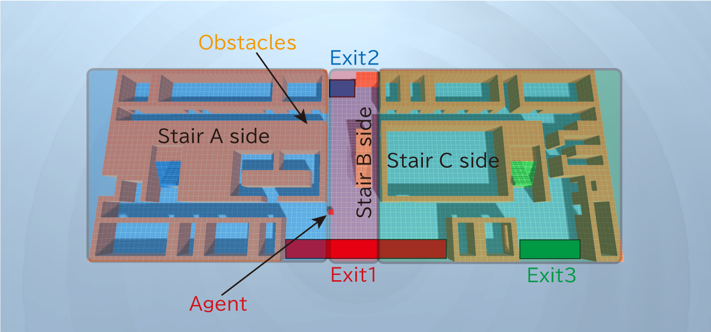

# EL_School
**Goal**: To learn how to escape from school as fast as possible.  
Using [ML-Agents](https://github.com/Unity-Technologies/ml-agents) in [Release 17](https://github.com/Unity-Technologies/ml-agents/tree/release_17).  

## Environments
1. School_Only1F (Curriculum Learning)

---
## Env-1. School_Only1F

### Image

### Environment

### Agent

### Rewards

### Result